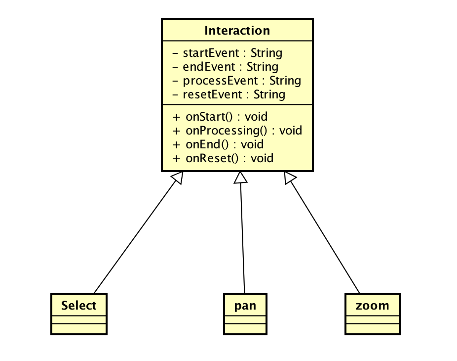

# Interaction

F2 provides an interaction mechanism to achieve the encapsulation and reuse of common interaction behavior. 

In F2, we believe that a specific interaction is composed of a series of basic events, and contains a series of feedback. Each interaction involves three steps:

1. start, there will be an event that trigger interaction
2. process, continuous state. Corresponding to an event
3. end, means the interaction is over, also has an event that trigger it.

Just like tooltip, usually is triggered by `touchstart`, and it will last by `touchmove`, when `touchend` is triggered, tooltip will hide.

### How to Define an Interaction class

```javascript
// The parent of all interaction classes
const Interaction = require('@antv/f2/lib/interaction/base');

const MyInteraction extends Interaction {
  getDefaultCfg() {
    return {
      startEvent: 'touchstart',
      processingEvent: 'touchmove',
      endEvent: 'touchend',
      resetEvent: 'touchstart'
    }
  }
  start(ev) {}
  process(ev) {}
  end(ev) {}
  reset(ev) {}
}
```

> Interaction support touch gestures\(based on [Hammer.js](http://hammerjs.github.io/)\) and touch events\(touchstart, touchmove, touchend\).



### How to register

```javascript
F2.Chart.registerInteraction('my-interaction', MyInteraction);
```

### How to Use

```javascript
chart.interaction('my-interaction', {
  startEvent: 'touchstart',
  /* ... */
});
```

see how we define ['pie-select'](https://github.com/antvis/f2/blob/master/src/interaction/pie-select.js) interaction class to get more detail.

